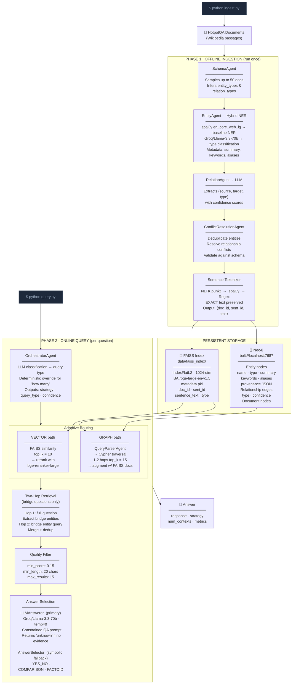
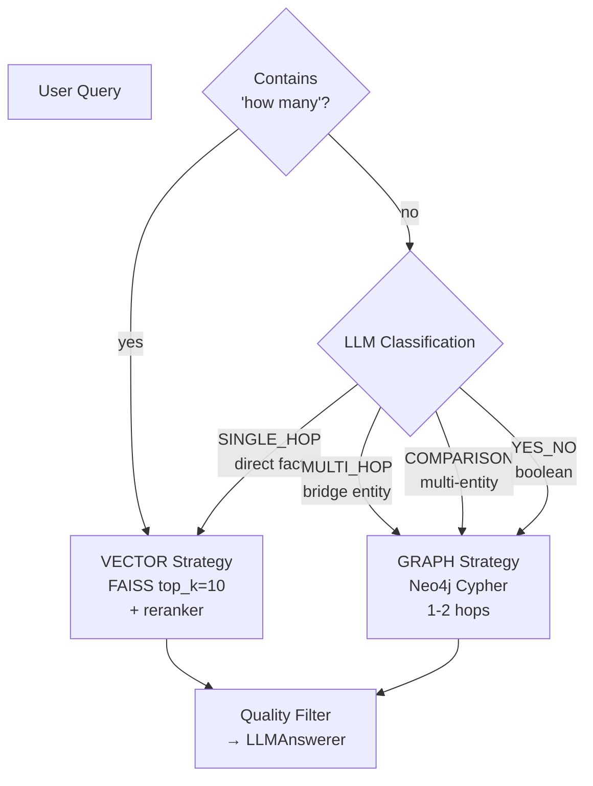
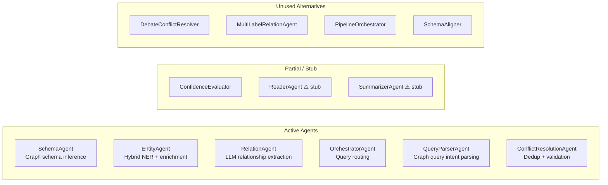
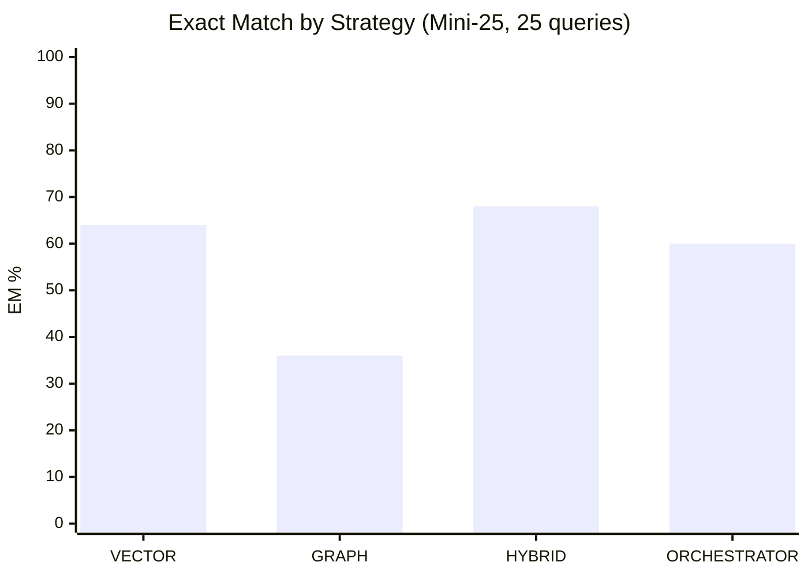

# Agentic GraphRAG — Architecture Diagram

## Full System Architecture

```mermaid
flowchart TD
    %% ─── INPUT ───────────────────────────────────────────────
    DOCS["📄 HotpotQA Documents\n(Wikipedia passages)"]

    %% ─── INGESTION PIPELINE ──────────────────────────────────
    subgraph INGEST["PHASE 1 · OFFLINE INGESTION  (run once)"]
        direction TB
        S1["SchemaAgent\n──────────────\nSamples up to 50 docs\nInfers entity_types &\nrelation_types"]
        S2["EntityAgent  ·  Hybrid NER\n──────────────\nspaCy en_core_web_lg → baseline NER\nGroq/Llama-3.3-70b → type classification\nMetadata: summary, keywords, aliases"]
        S3["RelationAgent  ·  LLM\n──────────────\nExtracts (source, target, type)\nwith confidence scores"]
        S4["ConflictResolutionAgent\n──────────────\nDeduplicate entities\nResolve relationship conflicts\nValidate against schema"]
        S5["Sentence Tokenizer\n──────────────\nNLTK punkt  →  spaCy  →  Regex\nEXACT text preserved\nOutput: ⟨doc_id, sent_id, text⟩"]
        S1 --> S2 --> S3 --> S4 --> S5
    end

    %% ─── STORAGE ─────────────────────────────────────────────
    subgraph STORE["PERSISTENT STORAGE"]
        direction LR
        NEO4J["🗄 Neo4j\nbolt://localhost:7687\n──────────────\nEntity nodes\n  name · type · summary\n  keywords · aliases\n  provenance JSON\nRelationship edges\n  type · confidence\nDocument nodes"]
        FAISS["🔢 FAISS Index\ndata/faiss_index/\n──────────────\nIndexFlatL2 · 1024-dim\nBAI/bge-large-en-v1.5\nmetadata.pkl\n  doc_id · sent_id\n  sentence_text · type"]
    end

    %% ─── QUERY PIPELINE ──────────────────────────────────────
    subgraph QUERY["PHASE 2 · ONLINE QUERY  (per question)"]
        direction TB

        ORCH["OrchestratorAgent\n──────────────\nLLM classification → query type\nDeterministic override for 'how many'\nOutputs: strategy · query_type · confidence"]

        subgraph ROUTING["Adaptive Routing"]
            direction LR
            VR["VECTOR path\n──────────────\nFAISS similarity\ntop_k = 10\n→ rerank with\nbge-reranker-large"]
            GR["GRAPH path\n──────────────\nQueryParserAgent\n→ Cypher traversal\n1-2 hops  top_k = 15\n→ augment w/ FAISS docs"]
        end

        TWOHOP["Two-Hop Retrieval\n(bridge questions only)\n──────────────\nHop 1: full question\nExtract bridge entities\nHop 2: bridge entity query\nMerge + dedup"]

        FILTER["Quality Filter\n──────────────\nmin_score: 0.15\nmin_length: 20 chars\nmax_results: 15"]

        ANS["Answer Selection\n──────────────\nLLMAnswerer  (primary)\n  Groq/Llama-3.3-70b · temp=0\n  Constrained QA prompt\n  Returns 'unknown' if no evidence\n\nAnswerSelector  (symbolic fallback)\n  YES_NO · COMPARISON · FACTOID"]

        ORCH --> ROUTING
        ROUTING --> TWOHOP
        TWOHOP --> FILTER
        FILTER --> ANS
    end

    %% ─── OUTPUT ──────────────────────────────────────────────
    OUT["💬 Answer\n──────────────\nresponse · strategy\nnum_contexts · metrics"]

    %% ─── CONNECTIONS ─────────────────────────────────────────
    DOCS --> INGEST
    S5 --> NEO4J
    S5 --> FAISS
    NEO4J --> GR
    FAISS --> VR
    FAISS --> GR
    QUERY --> OUT

    %% ─── CLI ENTRY POINTS ────────────────────────────────────
    CLI_I["$ python ingest.py"]:::cli --> DOCS
    CLI_Q["$ python query.py"]:::cli --> ORCH

    classDef cli fill:#1e293b,color:#94a3b8,stroke:#334155
```

---

## Query Routing Decision Tree

```mermaid
flowchart TD
    Q["User Query"]
    D1{"Contains\n'how many'?"}
    D2{"LLM Classification"}

    V["VECTOR Strategy\nFAISS top_k=10\n+ reranker"]
    G["GRAPH Strategy\nNeo4j Cypher\n1-2 hops"]

    D1 -->|yes| V
    D1 -->|no| D2
    D2 -->|SINGLE_HOP\ndirect fact| V
    D2 -->|MULTI_HOP\nbridge entity| G
    D2 -->|COMPARISON\nmulti-entity| G
    D2 -->|YES_NO\nboolean| G

    V --> F["Quality Filter\n→ LLMAnswerer"]
    G --> F
```

---

## Agent Inventory

```mermaid
flowchart LR
    subgraph ACTIVE["Active Agents"]
        A1["SchemaAgent\nGraph schema inference"]
        A2["EntityAgent\nHybrid NER + enrichment"]
        A3["RelationAgent\nLLM relationship extraction"]
        A4["OrchestratorAgent\nQuery routing"]
        A5["QueryParserAgent\nGraph query intent parsing"]
        A6["ConflictResolutionAgent\nDedup + validation"]
    end

    subgraph PARTIAL["Partial / Stub"]
        P1["ConfidenceEvaluator"]
        P2["ReaderAgent  ⚠️ stub"]
        P3["SummarizerAgent  ⚠️ stub"]
    end

    subgraph UNUSED["Unused Alternatives"]
        U1["DebateConflictResolver"]
        U2["MultiLabelRelationAgent"]
        U3["PipelineOrchestrator"]
        U4["SchemaAligner"]
    end
```

---

## Evaluation Results

```mermaid
xychart-beta
    title "Exact Match by Strategy (Mini-25, 25 queries)"
    x-axis ["VECTOR", "GRAPH", "HYBRID", "ORCHESTRATOR"]
    y-axis "EM %" 0 --> 100
    bar [64, 36, 68, 60]
```
